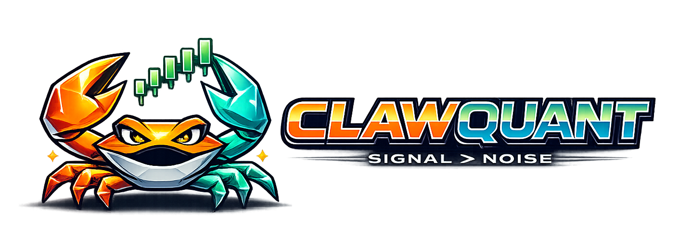

# ClawQuant

An open-source, lightweight, event-driven trading advisory system powered by LLMs.

<p align="center">
  
</p>

ClawQuant watches markets, news, and custom data feeds, runs AI analysis pipelines, and delivers actionable trade signals through Telegram, email, or any integration you build. It works across asset classes: stocks, crypto, ETFs, commodities, forex.

Aye, this be the part where your crab does the analysis and you decide when to make a move.

```bash
# One-line install (checks Python 3.11+, clones repo, creates venv, installs deps, runs setup wizard)
curl -fsSL https://raw.githubusercontent.com/tedboudros/ClawQuant/main/install.sh | bash
```

## How It Works

1. **Data flows in** -- market prices, trusted emails, news scrapers, and custom sources.
2. **AI does the thinkin'** -- a multi-agent pipeline writes investment memos and trade signals.
3. **Risk rules guard the vault** -- deterministic checks reject signals that violate your limits.
4. **You get the telegram (or email)** -- signal + memo delivered through any output integration.
5. **You call the shot** -- confirm, skip, or modify; AI and human outcomes are both tracked.
6. **It learns every week** -- AI-vs-human comparisons become structured memories for better future analysis.

## Key Features

- **Multi-asset**: Stocks, crypto, ETFs, bonds, commodities, forex -- anything with a ticker.
- **Dual portfolio**: Tracks what the AI would do and what you actually do, then learns from the gaps.
- **Investment memos**: Every signal comes with a structured Markdown memo covering thesis, scenarios, risks, and monitoring plan.
- **AI task factory**: The AI spins up follow-up tasks like daily monitoring, pre-earnings analysis, and post-earnings review.
- **Backtesting**: Run the same pipeline against historical data with zero lookahead bias. Compare LLM models side-by-side.
- **Plugin-based**: Integrations (Telegram, email, scrapers, etc.) are plugins, so you can bolt on your own.

## Design

- **Fully abstracted core**. 8 protocols define every extension point (market data, LLM providers, integrations, agents, risk rules). The core never imports concrete implementations.
- **Self-describing plugins**. Every plugin declares a `PLUGIN_META` dict (name, category, dependencies, config fields). The CLI auto-discovers them, so adding a plugin is just adding a file.
- **6 pip dependencies**. Everything else is Python stdlib.
- **File-based state**. Memos are Markdown. Positions are JSON. Logs are JSONL. All human-readable.
- **SQLite** for indexed queries (market data, memory search). No external database.
- **CLI-first setup**. One-line install, interactive setup wizard, all commands via `clawquant`.
- **Runs on a potato**. Single async Python process, ~100MB RAM, no Docker/Redis/PostgreSQL needed.

## Architecture

```
Integration Plugins (Telegram, Email, Scrapers, ...)
        ↕ HTTP
Core Server (aiohttp, ~200 LOC)
        ↕ in-process
EventBus → Audit Log (JSONL)
        ↕
┌───────────┬──────────┬──────────┬───────────┐
│ Scheduler │ AI       │ Risk     │ Simulator │
│ (task     │ Engine   │ Engine   │ (backtest │
│  files)   │ (agents) │ (rules)  │  replay)  │
└───────────┴──────────┴──────────┴───────────┘
        ↕
Files + SQLite (~/.clawquant/)
```

See [docs/](docs/) for the full architecture documentation.

## Quick Start

```bash
# Interactive setup wizard (configure plugins, API keys, integrations)
clawquant setup

# Start the server
clawquant start
```

Prefer to install manually?

```bash
git clone https://github.com/tedboudros/ClawQuant.git
cd ClawQuant
python -m venv .venv && source .venv/bin/activate
pip install -r requirements.txt
clawquant setup
```

## Configuration

Run `clawquant setup` for the interactive wizard, or `clawquant config` to re-run it later. The wizard generates `~/.clawquant/config.yaml` and `~/.clawquant/.env` from your choices.

For manual edits, see [docs/CONFIGURATION.md](docs/CONFIGURATION.md) for the full reference.

Other commands:

```bash
clawquant status              # show system status
clawquant plugin list         # list all available plugins
clawquant plugin <name>       # configure a specific plugin
clawquant plugin enable <n>   # enable a plugin
clawquant plugin disable <n>  # disable a plugin
```

## Documentation

| Document | Description |
|----------|-------------|
| [Architecture](docs/ARCHITECTURE.md) | Core components and how they connect |
| [Data Models](docs/DATA_MODELS.md) | All data schemas with on-disk examples |
| [Event Flows](docs/FLOWS.md) | Concrete event flows and lifecycle examples |
| [Learning Loop](docs/LEARNING_LOOP.md) | Dual portfolio and AI-human learning system |
| [Simulator](docs/SIMULATOR.md) | Backtesting, model benchmarking, validation |
| [Configuration](docs/CONFIGURATION.md) | Full config.yaml reference |
| [Tech Decisions](docs/TECH_DECISIONS.md) | Architectural decision records |

## License

MIT
